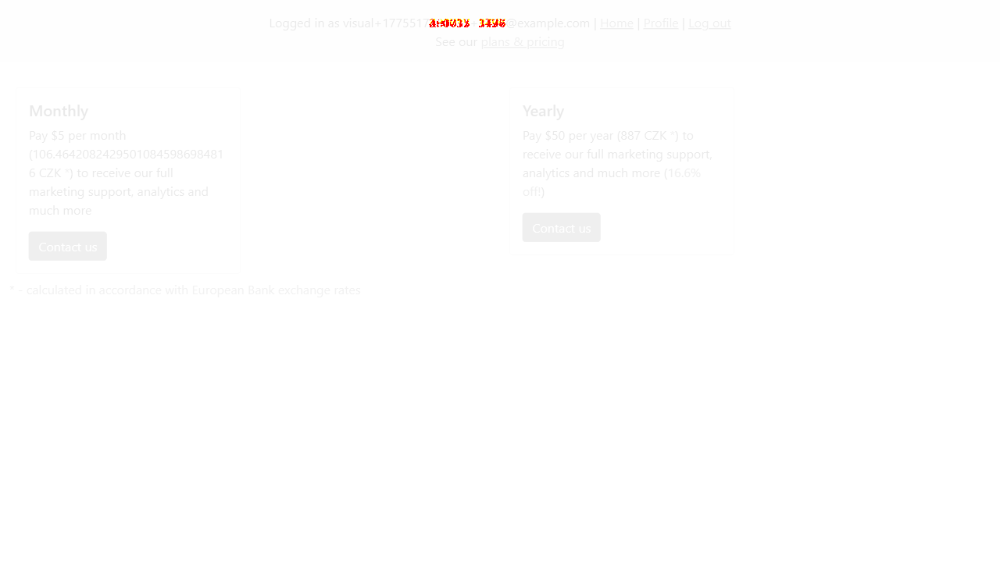

# Task 8 — automated tests

> Develop and provide 3 automated tests to cover any three defects of your choosing. The choice of programming language and automation tools is entirely up to you. Please host the automated test code in a remote repository (e.g., GitHub, GitLab) and provide the link to it.

The three tests in this repository are:

| Test case | Description |
|-----------|-------------|
| **7.1** | A user cannot edit a post; edit functionality does not work. |
| **6.9** | Cross-site scripting (XSS) vulnerability in the HTML body field. |
| *(no ID)* | The plans page layout looks wrong (visual regression). |

## Implementation

The tests live in the `tests/` folder and use [Playwright](https://playwright.dev/). They are written to **fail** cause the buggy behaviour is still present. The visual test compares against a reference screenshot in this case the reference image is almost identical and the test is designed to pass but it still show the capabilities to control the changes done to the frontend that may brake the baseline design.

Example diff heatmap from the plans page visual test (highlights pixel differences, e.g. in the header):

Each test creates the data it needs and cleans up afterward so the environment stays tidy.

AI tools have been used to, develop test and design the assigment, especially Playwright MCP server

## CI

A GitHub Actions workflow runs the test suite on each push and pull request to automate the test validation(see `.github/workflows/ci.yml`).

## Installation (app)

1. Install Docker. On macOS or Windows (WSL 2), use Docker Desktop.
2. From this project directory, run `docker-compose up -d`. Wait until all services are healthy.
3. Allow extra time for the database and NPM assets to finish setup. If you see Webpacker or database errors, wait a bit longer for startup to complete.

## Usage

1. Open http://localhost:3000 for the Rails app.

## Running tests

With the app reachable at http://localhost:3000:

1. Install dependencies: `npm install`
2. Install browsers (first time only): `npx playwright install chromium`
3. Run all tests: `npm test`

Useful scripts from `package.json`:

- `npm run test:tc71` — edit-post test (7.1)
- `npm run test:tc69` — XSS test (6.9)
- `npm run test:visual` — plans page visual test
- `npm run test:report` — open the HTML report under `tests/playwright-report`

For a headed browser or slow motion, see comments in `playwright.config.js`.
